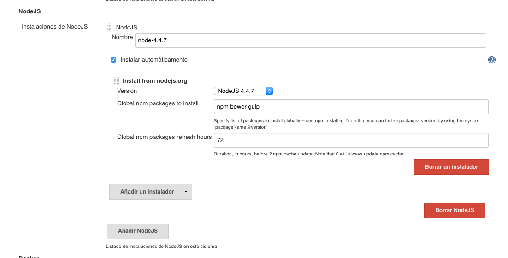

# smurfHouse

Application create like a personal study of houses market in Madrid/Spain. Basically the funcionallities are:
+ Define groupsearch to find. A groupsearch is a url from Idealista like a zone.
+ Daily update of house defined in the groupsearch in order to detect if a house has started or it has been updated the 
price or it has been ended. This search also update the ddbb but also elastic search db
+ Dashboard to show the updates per group
+ Dashboard market to provide a search form to can find in the local ddbb (elastic search) the house. 
The interesting point of this search, it is  the concept of block of search. Per each search:
  + system calculate the average price  and price/m2
  + Generate a graph with the house search (y=m2, x=price/m2)
  + Per each house, system determine the % upper/down price and price/m2 related to average of all search houses 

But, maybe it's easier to see in some pictures how works the dashboards. By the way, This application was generated 
using JHipster, you can find documentation and help at [https://jhipster.github.io](https://jhipster.github.io).


##Define group of search
Basically, this correspend how is set up the url to do the scratch. 


##Dashboard Updates
Simple screen to can filter by from/to date to can see the sumaration of the house news, updades or ended. 
Click in see, you can see the details


##Dashboard Market
In this screen, you can see the initial critera. Zona is a multiselect combobox


And here, you can find the sumarization of search (total number of house returned, average of price, average of meters 
average of price/m2). For Each house, it is show the prices and price/m2 comparate with the search done.


## Continuous Integration

To setup this project in Jenkins, use the following configuration:
[https://jhipster.github.io/setting-up-ci-jenkins2/](https://jhipster.github.io/setting-up-ci-jenkins2/)

See the overall of set up


Regarding with the Jenkinsfile file out of box that come with jhipster, i have changed in order to:
+ to have better control of versions. The version is set to version defined in the pom.xml plus "-" build number.
+ frontend and backend are not blocking for a build
+ Ask to scm user if wants make a release in git and in docker.
  + Versions in git 
  + Versions in docker (lastest version contains the last version push) 

In addiontal, in jenkins is need setup : 
+ the nodejs in the global tool configuration

+ the credentials to push to docker and git.


## Production
To run in production, the easier way is use docker/docker-compose. Commands to start or stop
    
    docker-compose -f app.yml up
    docker-compose -f app.yml stop


File: app.yml
```
version: '2'
services:
    smurfhouse-app:
        image: fmunozse/smurfhouse
        external_links:
            - smurfhouse-postgresql:postgresql
            - smurfhouse-elasticsearch:elasticsearch
        environment:
            - SPRING_PROFILES_ACTIVE=prod
            - SPRING_DATASOURCE_URL=jdbc:postgresql://postgresql:5432/smurfHouse
            - SPRING_DATASOURCE_USERNAME=smurfHouse
            - SPRING_DATASOURCE_PASSWORD=xxxxxxxxx
            - JHIPSTER_SLEEP=10 # gives time for the database to boot before the application
            - SPRING_DATA_ELASTICSEARCH_CLUSTER_NODES=elasticsearch:9300
        ports:
            - 80:8080
    smurfhouse-postgresql:
        extends:
            file: postgresql.yml
            service: smurfhouse-postgresql
    smurfhouse-elasticsearch:
        extends:
            file: elasticsearch.yml
            service: smurfhouse-elasticsearch
    smurfhouse-postgresql-backup:
        extends:
            file: postgresql_backup.yml
            service: smurfhouse-postgresql-backup
```

file elasticsearch.yml
```
version: '2'
services:
    smurfhouse-elasticsearch:
        container_name: smurfhouse-elasticsearch
        image: elasticsearch:1.7.5
        volumes:
            - /root/smurfhouse/elasticsearch:/usr/share/elasticsearch/data
        ports:
            - 9200:9200
            - 9300:9300
```

File: postgresql
```
version: '2'
services:
    smurfhouse-postgresql:
        container_name: smurfhouse-postgresql
        image: postgres:9.5.1
        volumes:
            - /root/smurfhouse/postgresql/data:/var/lib/postgresql/data
        environment:
            - POSTGRES_USER=smurfHouse
            - POSTGRES_PASSWORD=xxxxxxxxx
        ports:
            - 5432:5432
```

File: postgresql_backup
```
version: '2'
services:
    smurfhouse-postgresql-backup:
        container_name: smurfhouse-postgresql-backup
        image: fmunozse/pg-cron-backups
        volumes:
          - /root/smurfhouse/backups/:/data/backups/
        environment:
          - DB_HOST=smurfhouse-postgresql
          - DB_NAME=smurfHouse
          - DB_USER=smurfHouse
          - DB_PASS=xxxxxxxxx
          - CRON_SCHEDULE=30 23 * * *
          - MAIL_GMAIL_USER=xxxxxxxxx@gmail.com
          - MAIL_GMAIL_PWD=xxxxxxxxx
          - MAIL_TO=yyyyy@gmail.com
          - MAIL_FROM=xxxxxxxxx@gmail.com

```


## Development

Before you can build this project, you must install and configure the following dependencies on your machine:

1. [Node.js][]: We use Node to run a development web server and build the project.
   Depending on your system, you can install Node either from source or as a pre-packaged bundle.

After installing Node, you should be able to run the following command to install development tools (like
[Bower][] and [BrowserSync][]). You will only need to run this command when dependencies change in package.json.

    npm install

We use [Gulp][] as our build system. Install the Gulp command-line tool globally with:

    npm install -g gulp

Run the following commands in two separate terminals to create a blissful development experience where your browser
auto-refreshes when files change on your hard drive.

    ./mvnw
    gulp

Bower is used to manage CSS and JavaScript dependencies used in this application. You can upgrade dependencies by
specifying a newer version in `bower.json`. You can also run `bower update` and `bower install` to manage dependencies.
Add the `-h` flag on any command to see how you can use it. For example, `bower update -h`.


## Building for production

To optimize the smurfHouse client for production, run:

    ./mvnw -Pprod clean package

This will concatenate and minify CSS and JavaScript files. It will also modify `index.html` so it references
these new files.

To ensure everything worked, run:

    java -jar target/*.war

Then navigate to [http://localhost:8080](http://localhost:8080) in your browser.

## Testing

Unit tests are run by [Karma][] and written with [Jasmine][]. They're located in `src/test/javascript/` and can be run with:

    gulp test


[JHipster]: https://jhipster.github.io/
[Node.js]: https://nodejs.org/
[Bower]: http://bower.io/
[Gulp]: http://gulpjs.com/
[BrowserSync]: http://www.browsersync.io/
[Karma]: http://karma-runner.github.io/
[Jasmine]: http://jasmine.github.io/2.0/introduction.html
[Protractor]: https://angular.github.io/protractor/
